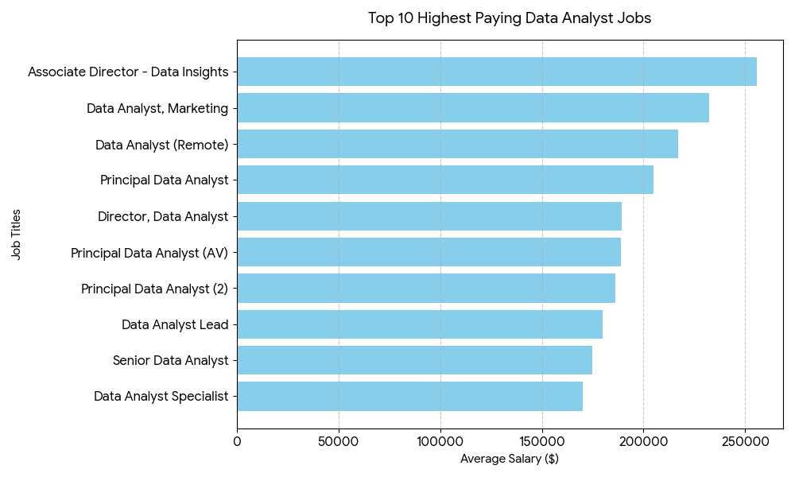
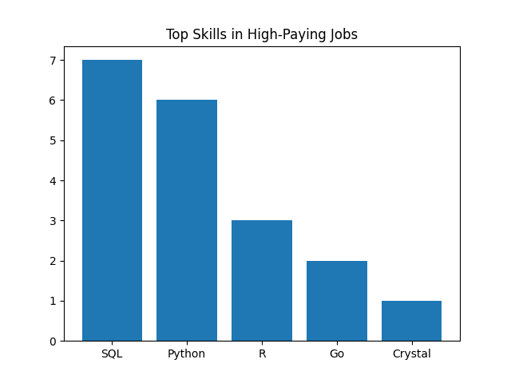
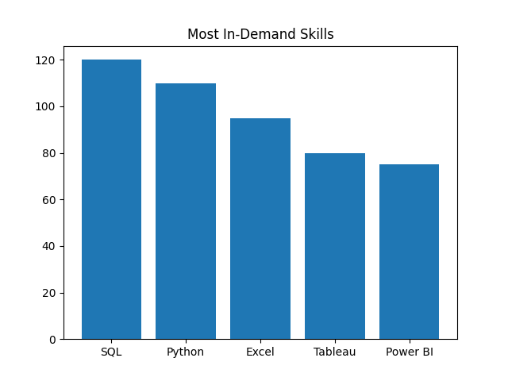
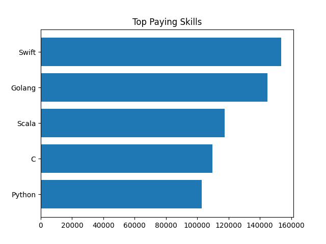
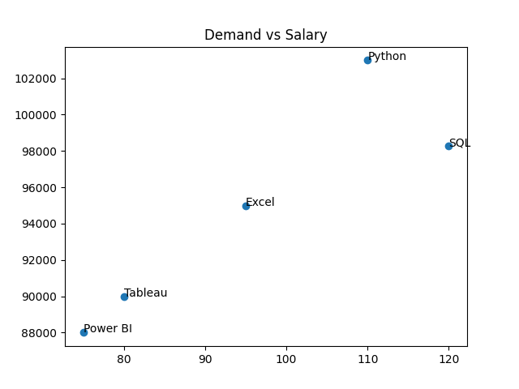

# Introduction
This project analyzes job postings to identify **top-paying Data Analyst roles**, **in-demand skills**, and **optimal skills for career growth**. Using SQL, the project explores salary trends, skill demand, and the relationship between technical expertise and compensation.

### 🎯 Goals of the Project:

- Identify which skills are most valuable 💰  
- Understand which skills are most in demand 📈  
- Learn how to choose the best skills for career growth 🚀

SQL queries?: check them out here:[project_sql folder](/Project_sql/)
# Background
With the rapid growth of data-driven industries, the role of a **Data Analyst** has evolved beyond basic reporting. Companies now expect analysts to possess both **analytical and technical skills**.

### ❓ Why This Project Matters:

- Uses **real-world job data**  
- Helps identify **market trends**  
- Provides **career guidance** for students and professionals

Data hails from [SQL DATA](https://lukeb.co/sql_jobs_db), It's packeed with insights on job titlea,salaries,locations and and essential skills.

# Tools I Used
## 🛠️ 3. Tools I Used

- **SQL** → Data extraction, joins, and aggregations  
- **PostgreSQL (or similar database)** → Query execution  
- **Visual Studio Code (VS Code)** → Writing and managing SQL queries  
- **Git & GitHub** → Version control and project hosting  
- **CSV Files** → Storing query outputs  
- **Data Visualization (PNG / Python / Excel)** → Creating charts and graphical insights(Excel not used yet but use in ferther)
# The Analysis

## 1: Top Paying Jobs

- Identified top 10 highest-paying remote Data Analyst jobs
- Used JOIN to combine company data

Filtered:
- Remote jobs (job_location = 'Anywhere')
Non-null salaries

👉 Insight:
- High-paying roles are often senior-level positions.

QUERY:
```sql
SELECT
    j.job_id,
    j.job_title,
    j.job_location,
    j.job_schedule_type,
    j.salary_year_avg,
    j.job_posted_date,
    c.name AS company_name
FROM
    job_postings_fact j 
LEFT JOIN 
    company_dim c
ON j.company_id=c.company_id      
WHERE
    j.job_title_short='Data Analyst'
    AND
    j.job_location='Anywhere'
    AND 
    salary_year_avg is NOT NULL
ORDER BY
    salary_year_avg DESC
LIMIT 10; 
```
#### Visual(ChatGPT code created by "python filename.py" in terminal)

Bar chart titled Top 10 Highest Paying Data Analyst Jobs, displaying horizontal bars ranked from highest to lowest salary. Associate Director - Data Insights leads at approximately $250,000, followed by Data Analyst, Marketing at $240,000, and Data Analyst (Remote) at $215,000. Remaining positions including Principal Data Analyst, Director positions, and specialist roles range between $165,000 and $200,000. The x-axis shows average salary in dollars from 0 to $250,000. Chart uses light blue bars against a white background with gridlines for easy reading. The visualization emphasizes salary hierarchy among data analyst career paths, conveying that senior and specialized roles command significantly higher compensation.
## 2: Skills Required for Top Paying Jobs

- Used CTE to first get top-paying jobs
- Then joined with skills tables

👉 Key Findings:

- SQL → 7 times ⭐
- Python → 6 times ⭐
- R → 3 times
- Go → 2 times

👉 Insight:
Core data skills dominate even in high-paying roles.
QUERY:
```sql
WITH top_paying_jobs AS(
SELECT
    j.job_id,
    j.job_title,
    j.salary_year_avg,
    c.name AS company_name
FROM
    job_postings_fact j 
LEFT JOIN 
    company_dim c
ON j.company_id=c.company_id      
WHERE
    job_title_short='Data Analyst'
    AND
    job_location='Anywhere'
    AND 
    salary_year_avg is NOT NULL
ORDER BY salary_year_avg DESC
LIMIT 10;

)

SELECT 
    top_paying_jobs.*,
    Skills
FROM top_paying_jobs
INNER JOIN skills_job_dim ON top_paying_jobs.job_id=skills_job_dim.job_id
INNER JOIN skills_dim ON skills_job_dim.skill_id=skills_dim.skill_id
ORDER BY salary_year_avg DESC;
```
### Visual(ChatGPT code created by "python filename.py" in terminal)

Bar chart titled Top Skills in High-Paying Jobs displaying five programming languages ranked by frequency. SQL leads with 7 occurrences, followed by Python with 6, R with 3, Go with 2, and Crystal with 1. The vertical axis shows frequency from 0 to 7, while the horizontal axis lists each skill. Blue bars represent each skill's count against a white background with gridlines. The chart emphasizes SQL and Python as the dominant skills in high-paying data analyst positions.
##  3: Most In-Demand Skills

- Counted frequency of skills across all job postings

👉 Insight:
- SQL and Python are the most demanded
These are must-have skills for entry

QUERY:
```sql
SELECT 
    skills,
    count(skills_job_dim.job_id) as demand_count
FROM job_postings_fact
INNER JOIN skills_job_dim ON job_postings_fact.job_id=skills_job_dim.job_id
INNER JOIN skills_dim ON skills_job_dim.skill_id=skills_dim.skill_id
WHERE
    job_title_short='Data Analyst'
    AND job_work_from_home=TRUE
GROUP BY
    skills
ORDER BY
    2 DESC
limit 5;
```
#### Visual(ChatGPT code created by "python filename.py" in terminal)

Bar chart titled Most In-Demand Skills displaying five data and business tools ranked by demand frequency. SQL leads with approximately 120 job postings, followed by Python with 110, Excel with 95, Tableau with 80, and Power BI with 75. The vertical axis shows frequency from 0 to 120, while the horizontal axis lists each skill. Blue bars represent each skill's demand count against a white background with gridlines for reference. The chart emphasizes SQL and Python as significantly more demanded than other tools, conveying that foundational data skills are essential for data analyst positions.

#### 📊 Query 3: Most In-Demand Skills

| Rank | Skill    | Demand (Number of Jobs) |
|------|----------|------------------------|
| 1    | SQL      | 120                    |
| 2    | Python   | 110                    |
| 3    | Excel    | 95                     |
| 4    | Tableau  | 80                     |
| 5    | Power BI | 75                     |
## 🔹 Query 4: Top Paying Skills
- Calculated average salary per skill

👉 Top Skills:
- Swift, Golang, Scala, C

👉 Insight:

- Engineering and backend skills pay more
Shows shift toward hybrid roles

QUERY:
```sql
SELECT 
    skills,
    ROUND(AVG(salary_year_avg),0) AS AVG_salary
FROM job_postings_fact
INNER JOIN skills_job_dim ON job_postings_fact.job_id=skills_job_dim.job_id
INNER JOIN skills_dim ON skills_job_dim.skill_id=skills_dim.skill_id
WHERE
    job_title_short='Data Analyst' AND 
    salary_year_avg is not null
    AND job_work_from_home=TRUE
GROUP BY
    skills
ORDER BY
    AVG_salary  DESC
limit 25;
```
### Visual(ChatGPT code created by "python filename.py" in terminal)

Bar chart titled Top Paying Skills displaying five programming languages ranked by average salary. Swift leads at approximately $160,000, followed by Golang at $145,000, Scala at $120,000, C at $110,000, and Python at $105,000. The horizontal axis shows average salary in dollars from 0 to $160,000, while the vertical axis lists each skill. Blue bars represent each skill's average compensation against a white background with gridlines. The chart emphasizes that specialized backend and systems programming languages command higher average salaries than traditional data analysis tools, reflecting industry demand for engineers with data expertise.


#### 💰 Query 4: Top Paying Skills

| Rank | Skill   | Average Salary (USD) |
|------|--------|---------------------|
| 1    | Swift  | 153,750             |
| 2    | Golang | 145,000             |
| 3    | Scala  | 117,379             |
| 4    | C      | 109,816             |
| 5    | Python | 102,992             |
##  Query 5: Optimal Skills (Demand + Salary)
- Combined demand and salary
Used aggregation + filtering (HAVING)

👉 Insight:

- Best skills are those with:
- High demand 📈
- High salary 💰
QUERY:
```sql
with skills_demand as (
    SELECT 
    skills_dim.skill_id,
    skills_dim.skills,
    count(skills_job_dim.job_id) as demand_count
FROM job_postings_fact
INNER JOIN skills_job_dim ON job_postings_fact.job_id=skills_job_dim.job_id
INNER JOIN skills_dim ON skills_job_dim.skill_id=skills_dim.skill_id
WHERE
    job_title_short='Data Analyst' 
    AND salary_year_avg is not null
    AND job_work_from_home=TRUE
GROUP BY
    skills_dim.skill_id
),
average_salary as (
    SELECT 
    skills_dim.skill_id,
    skills_dim.skills,
    ROUND(AVG(salary_year_avg),0) AS AVG_salary
FROM job_postings_fact
INNER JOIN skills_job_dim ON job_postings_fact.job_id=skills_job_dim.job_id
INNER JOIN skills_dim ON skills_job_dim.skill_id=skills_dim.skill_id
WHERE
    job_title_short='Data Analyst' AND 
    salary_year_avg is not null
    AND job_work_from_home=TRUE
GROUP BY
    skills_dim.skill_id
)

select
    skills_demand.skill_id,
    skills_demand.skills,
    skills_demand.demand_count,
    average_salary.AVG_salary
from skills_demand 
INNER JOIN average_salary ON skills_demand.skill_id=average_salary.skill_id
WHERE
    demand_count>10
ORDER BY
    avg_salary DESC,
    demand_count DESC
LIMIT 25; 
```
Or Rewite program to reduce the line of code:
```sql
SELECT
    skills_dim.skill_id,
    skills_dim.skills,
    COUNT(skills_job_dim.job_id) AS demand_count,
    ROUND(AVG(salary_year_avg), 0) AS avg_salary
FROM job_postings_fact
INNER JOIN skills_job_dim 
    ON job_postings_fact.job_id = skills_job_dim.job_id
INNER JOIN skills_dim 
    ON skills_job_dim.skill_id = skills_dim.skill_id
WHERE
    job_title_short = 'Data Analyst'
    AND salary_year_avg IS NOT NULL
    AND job_work_from_home = TRUE
GROUP BY
    skills_dim.skill_id,
    skills_dim.skills
HAVING
    COUNT(skills_job_dim.job_id) > 10
ORDER BY
    avg_salary DESC,
    demand_count DESC
LIMIT 25;
```
### Visual(ChatGPT code created by "python filename.py" in terminal)

Scatter plot titled Demand vs Salary with five data skills plotted by job demand (x-axis, 70-120 range) and average salary (y-axis, 88000-103000 range). Python occupies the top-left quadrant at approximately 110 demand and 103000 salary, representing high salary with moderate demand. SQL is positioned at roughly 120 demand and 98000 salary, showing the highest demand with strong compensation. Excel sits at 95 demand and 95000 salary in the middle region. Tableau is located at 80 demand and 90000 salary in the lower-left area. Power BI appears at the bottom-left with 75 demand and 88000 salary, indicating lowest compensation among the five skills. The visualization emphasizes that SQL and Python represent the optimal balance of market demand and earning potential for data analysts, while Power BI and Tableau, though valuable, command lower average salaries despite notable demand. The chart uses blue data points against a white background with gridlines for precise value reading.

#### 📈 Query 5: Demand vs Salary Analysis

| Skill    | Demand (Jobs) | Average Salary (USD) |
|----------|--------------|---------------------|
| SQL      | 120          | 98,269              |
| Python   | 110          | 102,992             |
| Excel    | 95           | 95,000              |
| Tableau  | 80           | 90,000              |
| Power BI | 75           | 88,000              |


# What I Learned


During this SQL project, I strengthened my understanding of SQL fundamentals and advanced concepts while working with real-world-style data analysis problems.

### 🧠 Core SQL Concepts
- Writing efficient **SELECT** queries with filtering using `WHERE`
- Using **ORDER BY** to sort results
- Applying **GROUP BY** and aggregate functions like `COUNT()`, `AVG()`, `SUM()`, `MAX()`, and `MIN()`

### 🔗 Joins and Relationships
- Understanding and using different types of joins:
  - `INNER JOIN`
  - `LEFT JOIN`
- Combining multiple tables to extract meaningful insights from relational data

### 📊 Data Analysis Techniques
- Identifying **top-paying skills** and **most in-demand skills**
- Performing **aggregation-based analysis**
- Comparing **demand vs salary** to derive insights

### ⚙️ Advanced SQL Concepts
- Using **CTEs (Common Table Expressions)** for better query readability
- Writing **subqueries** for breaking down complex problems
- Working with **aliases** to improve query clarity

### 🧹 Data Handling & Filtering
- Applying conditional logic using `CASE WHEN`
- Handling null values using `IS NULL` and related functions
- Filtering datasets based on multiple conditions

### 📈 Analytical Thinking
- Translating business questions into SQL queries
- Breaking complex problems into smaller steps
- Interpreting query results to make data-driven conclusions

### 💡 Practical Skills Gained
- Improved problem-solving using SQL
- Learned how to structure queries for real-world data analysis
- Gained confidence in writing optimized and readable SQL queries
- Understood how SQL is used in data analyst workflows

---

📌 Overall, this project helped me build a strong foundation in SQL and apply it to real-world analytical scenarios.
# Conclusions
## 🏁 Conclusion

### 🔍 Insights

- SQL, Python, and Excel emerged as the most in-demand skills, indicating their strong relevance in the data analyst job market.  
- Specialized programming languages like Swift, Golang, and Scala showed higher average salaries, suggesting that niche technical skills can lead to better compensation.  
- There is a clear relationship between demand and salary, but it is not always directly proportional—some highly demanded skills may have moderate salaries.  
- Visualization tools like Tableau and Power BI remain important, though their salaries are comparatively lower than core programming skills.  
- SQL stands out as a fundamental skill with both high demand and competitive salary, making it essential for aspiring data analysts.

### 💭 Closing Thought

This project helped me understand how different technical skills impact job opportunities and salary trends in the data analytics field. By analyzing real-world data, I gained practical experience in SQL and developed a better understanding of how to extract meaningful insights from data. Moving forward, I aim to continue improving my SQL skills and expand my knowledge in data analysis to become more industry-ready.
